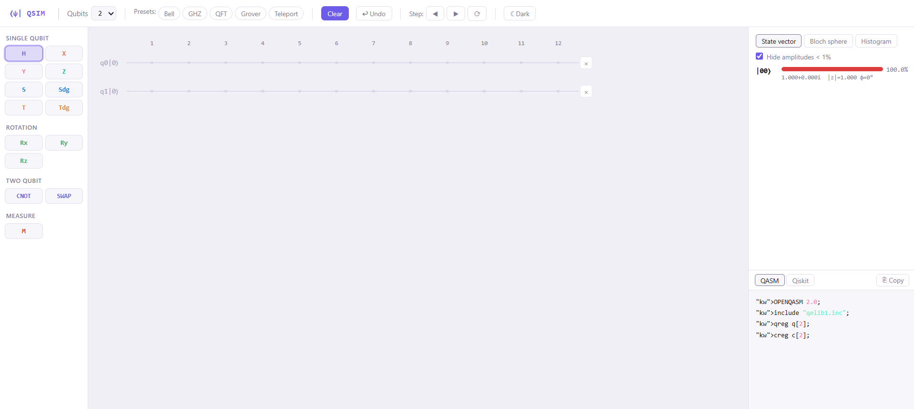
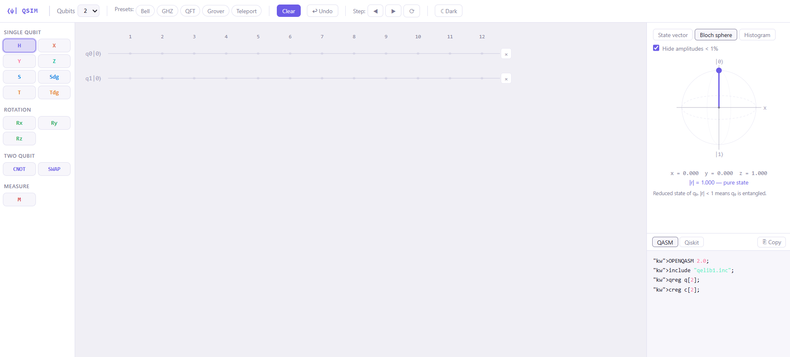
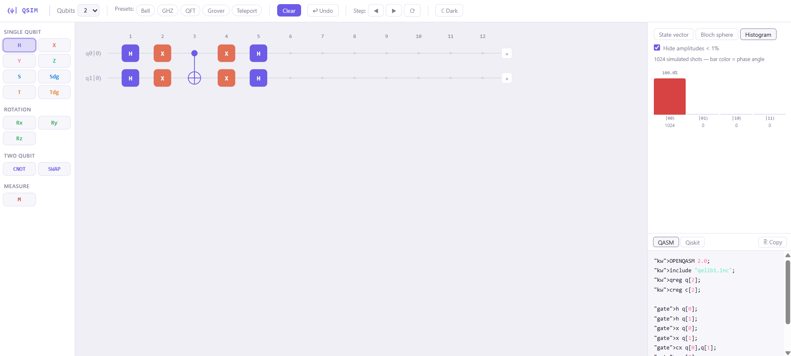

# qsim

A quantum circuit simulator I wrote in vanilla JS. No libraries for the quantum parts — state vector, gate math, measurement are all done from scratch.



---

## what it does

- simulates 1 to 8 qubits (full 2ⁿ state vector)
- 13 gates: H, X, Y, Z, S, S†, T, T†, Rx, Ry, Rz, CNOT, SWAP, and measurement
- click or drag gates from the sidebar onto the wires
- state vector panel on the right — shows probability, amplitude (re+im·i), magnitude, phase angle. bar color maps to phase so you can see phase relationships at a glance
- Bloch sphere for qubit 0's reduced state
- histogram of 1024 simulated measurements
- **generates OpenQASM 2.0 and Qiskit Python code** live as you build — just click Copy
- step through the circuit one column at a time to watch the state evolve
- undo (50 steps), dark mode, 5 preset circuits
- 32 unit tests

---

## running it

needs a static server because of ES modules:

```bash
git clone https://github.com/blackfang007/qsim
cd qsim
npx serve .
```

then open `http://localhost:3000`.

```bash
# tests
node src/tests.js
```

---

## QASM and Qiskit export

every circuit you build is automatically translated to code in the bottom-right panel. toggle between formats with the QASM / Qiskit buttons.

**OpenQASM 2.0** (works with IBM Quantum, Qiskit, most cloud services):

```
OPENQASM 2.0;
include "qelib1.inc";
qreg q[2];
creg c[2];

h q[0];
cx q[0],q[1];
```

**Qiskit Python**:

```python
from qiskit import QuantumCircuit

qc = QuantumCircuit(2, 2)
qc.h(0)
qc.cx(0, 1)

print(qc.draw())
```

click ⎘ Copy to grab whichever format you need.

---

## screenshots

### Bloch sphere
qubit 0's reduced state. when it's entangled with other qubits the vector shrinks — |r| < 1 means mixed state.



### circuit + live code generation
the QASM/Qiskit panel updates as you place gates.


### histogram
1024 simulated shots. bar color = phase angle of the amplitude.



---

## structure

```
src/
├── core/
│   ├── complex.js      complex number math (mul, add, abs, phase, fromPolar)
│   ├── statevector.js  state vector + gate application + measurement
│   ├── circuit.js      circuit model, undo history, QASM/Qiskit export
│   └── runner.js       runs a circuit against a state vector
├── gates/
│   └── gates.js        2×2 unitary matrices for each gate
├── ui/
│   ├── palette.js      gate sidebar with hover tooltips
│   ├── renderer.js     SVG circuit grid, drag-and-drop
│   ├── statepanel.js   state vector / Bloch / histogram tabs
│   └── qasmpanel.js    live code panel with syntax highlighting
├── app.js              ties everything together
└── tests.js            32 unit tests
```

---

## how the simulation works

an n-qubit system is a `Complex[]` array of length 2ⁿ. index `i` = basis state `|i⟩` in binary.

applying a gate to qubit `q` means: for every pair of indices that differ only in bit `q`, apply the 2×2 matrix to those two amplitudes. that's literally the whole engine — one loop, handles every single-qubit gate.

```js
applyGate(qubit, mat) {
  for (let i = 0; i < dim; i++) {
    if ((i >> bit) & 1) continue;
    const j = i | (1 << bit);
    const a = amps[i], b = amps[j];
    amps[i] = mat[0][0].mul(a).add(mat[0][1].mul(b));
    amps[j] = mat[1][0].mul(a).add(mat[1][1].mul(b));
  }
}
```

CNOT is just: if control bit = 1, swap amplitudes at `i` and `i XOR targetBit`.

measurement uses the Born rule — `P(|i⟩) = |amp_i|²` — samples from that distribution, zeroes inconsistent amplitudes, renormalises.

the Bloch sphere computes the reduced density matrix `ρ₀ = Tr_rest(|ψ⟩⟨ψ|)` and extracts `(x, y, z) = (2Re(ρ₀₁), 2Im(ρ₀₁), ρ₀₀ - ρ₁₁)`.

---

## gates

| gate | matrix | what it does |
|------|--------|--------------|
| H | `1/√2 [[1,1],[1,-1]]` | superposition |
| X | `[[0,1],[1,0]]` | bit flip |
| Y | `[[0,-i],[i,0]]` | bit + phase flip |
| Z | `[[1,0],[0,-1]]` | phase flip on \|1⟩ |
| S | `[[1,0],[0,i]]` | +i phase on \|1⟩ |
| T | `[[1,0],[0,e^iπ/4]]` | π/8 rotation |
| Rz | `diag(e^-iθ/2, e^iθ/2)` | Z rotation |
| CNOT | — | flip target if control=1 |
| SWAP | — | swap two qubits |
| M | — | measure, collapse state |

---

## presets

| name | qubits | state |
|------|--------|-------|
| Bell | 2 | `(|00⟩ + |11⟩) / √2` |
| GHZ | 3 | `(|000⟩ + |111⟩) / √2` |
| QFT | 2 | quantum Fourier transform |
| Grover | 2 | amplitude amplification |
| Teleport | 3 | teleportation protocol |

---

## todo

- [ ] Toffoli (CCX)
- [ ] editable angle for Rx/Ry/Rz
- [ ] noise / decoherence model
- [ ] save/load circuit as JSON
- [ ] GitHub Pages deploy

---

[blackfang007](https://github.com/blackfang007)